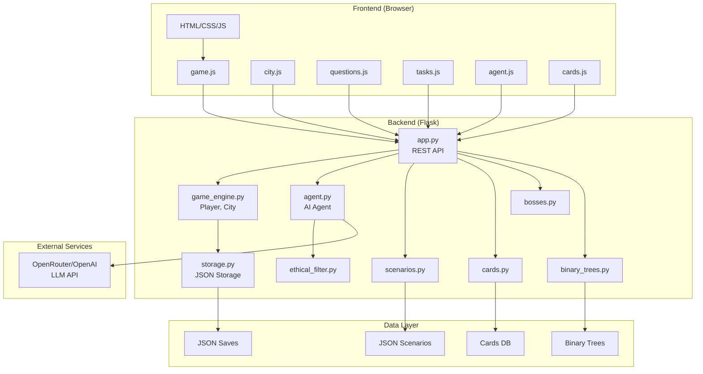

# Концептуальная документация InnerQuest: Город Сфер

## 1. Архитектурный обзор

### 1.1 Общая структура

Проект построен по архитектуре **MVC (Model-View-Controller)** с разделением на:

- **Backend (Python/Flask)** — игровая логика, AI-агент, хранение данных
- **Frontend (HTML/CSS/JavaScript)** — пользовательский интерфейс, визуализация
- **Data Layer (JSON)** — сохранения, сценарии, карточки, деревья вопросов

### 1.2 Поток данных

```javascript
Пользователь → Frontend (JS) → Flask API → Game Engine → Storage (JSON)
                ↓                                    ↓
            AI Agent ←─── Ethical Filter ←─── Player Data
```


### 1.3 Ключевые компоненты

1. **Игровой движок** (`game_engine.py`) — состояние игрока, прогресс, механики
2. **AI-агент** (`agent.py`) — диалоги с Айрой, генерация ответов
3. **Менеджеры контента** — сценарии, карточки, боссы, деревья вопросов
4. **Визуализация** — карта города, экраны, анимации
5. **Система заданий** — микрозадания, мини-игры

---

## 2. Детальное описание файлов

### 2.1 Backend (Python модули)

#### `app.py` — Flask приложение и API

**Назначение**: Точка входа, REST API эндпоинты, координация компонентов**Ключевые функции**:

- `/api/progress` — получение прогресса игрока
- `/api/session/start` — начало игровой сессии
- `/api/session/end` — завершение сессии с наградами
- `/api/agent/chat` — диалог с AI-агентом
- `/api/tree/start` — начало бинарного дерева вопросов
- `/api/tree/traverse` — обход дерева на основе ответов
- `/api/task/complete` — завершение задания
- `/api/cards/*` — управление карточками
- `/api/boss/*` — механики боссов

**Зависимости**: Все менеджеры (scenarios, cards, bosses, binary_trees), game_engine, agent

#### `game_engine.py` — Игровая логика

**Назначение**: Ядро игровой механики, состояние игрока, прогрессия**Классы**:

- `Player` — состояние игрока, очки, сессии, разблокировки
- `City` — визуальное состояние кварталов, темы, информация

**Ключевые методы**:

- `start_session()` — начало сессии с проверкой кулдауна
- `complete_session()` — завершение с начислением очков
- `check_unlocks()` — автоматическая разблокировка контента
- `get_visual_state()` — генерация визуального состояния квартала

**Зависимости**: `storage.py`, `config.py`

#### `agent.py` — AI-агент Айра

**Назначение**: Генерация диалогов, поддержка игрока, бинарный поиск проблем**Класс**: `AgentAira`**Ключевые методы**:

- `generate_response()` — генерация ответа через LLM
- Интеграция с OpenRouter/OpenAI API
- Использование системного промпта для персонажа
- Контекст из истории игрока

**Зависимости**: `openai`, `ethical_filter.py`, `game_engine.py`, `config.py`

#### `storage.py` — Система хранения

**Назначение**: Сохранение/загрузка данных игрока в JSON**Класс**: `Storage`**Функции**:

- `load_player()` — загрузка данных из JSON
- `save_player()` — сохранение прогресса
- `level_up_district()` — повышение уровня квартала
- `unlock_district()` — разблокировка квартала
- Миграция данных при изменении структуры

**Формат данных**: JSON файлы в `data/saves/{player_id}.json`

#### `scenarios.py` — Менеджер сценариев

**Назначение**: Управление уровнями кварталов, сюжетными актами**Класс**: `ScenariosManager`**Функции**:

- Загрузка JSON-файлов сценариев из `scenarios/*_levels.json`
- Получение текущего уровня квартала
- Определение наград и разблокировок
- Триггеры событий по прогрессу

**Файлы данных**: `scenarios/{district}_levels.json` (oasis, citadel, arsenal, forum, garden)

#### `cards.py` — Система карточек

**Назначение**: Управление карточками (Skill, Relic, Contract, Lore, Companion, Hazard)**Класс**: `CardsManager`**Функции**:

- Загрузка базы карточек из `scenarios/cards_database.json`
- Определение доступных карт по действиям игрока
- Открытие карт за Effort
- Экипировка/активация карт
- Детерминированные правила открытия

**Типы карт**: Skill, Relic, Contract, Lore, Companion, Hazard**Редкости**: Common, Rare, Epic, Legendary

#### `bosses.py` — Система боссов

**Назначение**: Управление боссами, условия появления, механики**Класс**: `BossesManager`**Функции**:

- Проверка условий появления босса
- Загрузка данных из `scenarios/bosses.json`
- Механики победы над боссом
- Эффекты боссов на игровой процесс

**Боссы**: Шепот Пинга, Счётовод Дедлайнов, Коллектор Тревоги, Комментатор Сравнения, Архивариус Шума

#### `binary_trees.py` — Бинарные деревья вопросов

**Назначение**: Система диагностики проблем через вопросы**Класс**: `BinaryTreesManager`**Функции**:

- Загрузка деревьев из `scenarios/binary_trees.json`
- Получение корневого вопроса
- Обход дерева на основе ответов
- Определение следующего узла или задания

**Типы узлов**: choice, scale, open_or_choice, task_trigger, reflection, end

#### `ethical_filter.py` — Этический фильтр

**Назначение**: Обнаружение кризисных сообщений, защита игрока**Класс**: `EthicalFilter`**Функции**:

- Анализ сообщений на кризисные признаки
- Блокировка игрового контента при кризисе
- Показ горячих линий помощи
- Интеграция с AI-агентом

#### `config.py` — Конфигурация

**Назначение**: Настройки игры, API ключи, константы**Параметры**:

- `OPENAI_API_KEY` — ключ для AI
- `OPENAI_MODEL` — модель LLM
- `OPENAI_BASE_URL` — URL API (OpenRouter)
- `SESSION_COOLDOWN_HOURS` — кулдаун между сессиями
- `POINTS_PER_SESSION` — базовые очки за сессию
- `UNLOCK_THRESHOLD` — порог разблокировки кварталов

---

### 2.2 Frontend (JavaScript модули)

#### `game.js` — Основная игровая логика

**Назначение**: Управление экранами, сессиями, состоянием игры**Класс**: `Game`**Функции**:

- `init()` — инициализация игры
- `loadProgress()` — загрузка прогресса с сервера
- `showScreen()` — переключение экранов
- `startSession()` — начало сессии
- `confirmEmotion()` — подтверждение эмоции
- `endSession()` — завершение сессии
- `updateCityMap()` — обновление визуализации города

**Экраны**: loading-screen, city-map, emotion-select, questions-screen, task-screen, agent-dialog, results-screen, diary-screen

#### `city.js` — Визуализация города

**Назначение**: Рендеринг кварталов, эффекты, анимации**Класс**: `CityVisualizer`**Функции**:

- `updateDistrict()` — обновление визуального состояния квартала
- `renderDistrict()` — применение эффектов (яркость, огни, туман)
- `animateDistrictUnlock()` — анимация разблокировки
- `showPointsAnimation()` — анимация начисления очков

**Эффекты**: brightness, lights_count, fog_density

#### `questions.js` — Система вопросов

**Назначение**: Рендеринг бинарных деревьев вопросов, обработка ответов**Класс**: `QuestionTree`**Функции**:

- `startTree()` — начало дерева вопросов
- `renderQuestion()` — отображение вопроса
- `answerQuestion()` — обработка ответа и переход к следующему узлу
- `renderChoiceOptions()` — кнопки выбора
- `renderOpenWithFallback()` — открытый вопрос с fallback опциями
- `triggerTask()` — переход к заданию

**Типы вопросов**: choice, scale, open_or_choice, reflection

#### `tasks.js` — Интерактивные задания

**Назначение**: Рендеринг и выполнение микрозаданий**Класс**: `TaskManager`**Типы заданий**:

- `reflection` — текстовое размышление (минимум слов)
- `timer` — таймер с визуализацией
- `choice` — выбор из вариантов
- `checklist` — список пунктов
- `number_input` — ввод числа
- `habit_creation` — создание привычки
- `people_list` — список людей

**Функции**:

- `startTask()` — начало задания
- `completeTask()` — завершение с валидацией
- `validateTaskResult()` — проверка выполнения

#### `minigames.js` — Мини-игры

**Назначение**: Перетаскивание сферы, дыхательные упражнения**Класс**: `Minigames`**Мини-игры**:

- **Сфера**: создание сферы из текста, drag & drop в цель
- **Дыхание**: синхронизация дыхания с анимацией (4-4-4 секунды)

**Функции**:

- `initSphereGame()` — инициализация игры сферы
- `setupDragAndDrop()` — обработка перетаскивания
- `initBreathingGame()` — инициализация дыхания
- `completeSphereGame()` — завершение сферы
- `completeBreathingGame()` — завершение дыхания

#### `agent.js` — Диалог с Айрой

**Назначение**: Интерфейс чата с AI-агентом**Класс**: `AgentDialog`**Функции**:

- `startDialog()` — начало диалога
- `addMessage()` — добавление сообщения
- `sendMessage()` — отправка сообщения на сервер
- `setContext()` — установка контекста для AI

#### `cards.js` — Card Rail

**Назначение**: Рейка карточек справа от чата**Класс**: `CardRail`**Функции**:

- `loadCards()` — загрузка карт игрока
- `renderCardRail()` — отрисовка рейки (5 слотов)
- `renderSlot()` — отрисовка слота карты
- `equipCard()` — экипировка карты
- `activateCard()` — активация активной карты
- Drag & Drop для активации

#### `bosses.js` — Экраны боссов

**Назначение**: Визуализация встреч с боссами**Класс**: `BossEncounter`**Функции**:

- Рендеринг экрана босса
- Диалоги босса
- Механики победы
- Анимации и эффекты

#### `guru.js` — Режим ГУРУ

**Назначение**: Свободные вопросы к Айре после сессии**Класс**: `GuruMode`**Функции**:

- Открытие режима ГУРУ
- Отправка вопросов
- Отображение ответов
- Интеграция с памятью агента

#### `easter-eggs.js` — Пасхалки

**Назначение**: Скрытые функции, читы, консольные команды**Класс**: `EasterEggs`**Пасхалки**:

- Konami Code (↑↑↓↓←→←→BA)
- Консольные команды (`gameCommands.*`)
- Секретные комбинации кликов
- Философские цитаты

---

### 2.3 Frontend (CSS модули)

#### `style.css` — Основные стили

**Назначение**: Базовые стили, экраны, компоненты UI**Секции**:

- Общие стили (цвета, типографика)
- Экраны (screen, active)
- Карта города (city-map, districts)
- Выбор эмоций (emotion-select)
- Диалог с агентом (agent-dialog)
- Мини-игры (sphere-minigame, breathing-minigame)
- Кнопки и формы
- Анимации

#### `questions.css` — Стили вопросов

**Назначение**: Визуализация бинарных деревьев вопросов**Компоненты**:

- `.question-text` — текст вопроса
- `.question-option` — кнопки выбора
- `.question-scale` — шкала интенсивности
- `.open-input` — текстовое поле
- `.question-divider` — разделитель

#### `tasks.css` — Стили заданий

**Назначение**: Визуализация интерактивных заданий**Компоненты**:

- `.task-title`, `.task-prompt` — заголовок и описание
- `.task-input-large` — большое текстовое поле
- `.task-timer-circle` — таймер
- `.task-option-card` — карточки выбора
- `.checklist-item` — пункты чеклиста

#### `cards.css` — Стили карточек

**Назначение**: Card Rail, карточки, магазин**Компоненты**:

- `#card-rail` — рейка карточек (fixed справа)
- `.card-slot` — слот карты
- `.card` — сама карта
- Редкости (common, rare, epic, legendary)
- Модальные окна деталей

#### `bosses.css` — Стили боссов

**Назначение**: Визуализация встреч с боссами**Компоненты**:

- Экраны боссов
- Диалоги
- Анимации появления

#### `guru.css` — Стили режима ГУРУ

**Назначение**: Интерфейс свободных вопросов---

### 2.4 Данные (JSON файлы)

#### `scenarios/{district}_levels.json`

**Назначение**: Уровни кварталов, сценарии, награды**Структура**:

- `level_id` — идентификатор уровня
- `act` — номер акта
- `prompt` — промпт для AI
- `rewards` — награды (очки, карты, разблокировки)
- `unlocks` — что разблокируется

#### `scenarios/binary_trees.json`

**Назначение**: Бинарные деревья вопросов для диагностики**Структура**:

- `tree_id` — идентификатор дерева
- `root` — корневой вопрос
- `nodes` — узлы дерева
- Типы узлов: choice, scale, open_or_choice, task_trigger

#### `scenarios/cards_database.json`

**Назначение**: База данных всех карточек**Структура**:

- `card_id` — идентификатор
- `name`, `type`, `rarity` — свойства
- `cost` — стоимость в Effort
- `effect` — описание эффекта
- `unlock_conditions` — условия открытия

#### `scenarios/bosses.json`

**Назначение**: Данные боссов**Структура**:

- `boss_id` — идентификатор
- `name`, `description` — описание
- `spawn_conditions` — условия появления
- `defeat_conditions` — условия победы
- `effects` — эффекты босса

#### `data/saves/{player_id}.json`

**Назначение**: Сохранение прогресса игрока**Структура**:

- `stability_points` — очки устойчивости
- `effort` — валюта Effort
- `districts` — состояние кварталов
- `owned_cards` — открытые карты
- `completed_levels` — завершённые уровни
- `session_history` — история сессий
- `actions_history` — история действий

---

### 2.5 Документация (Markdown файлы)

#### `README.md` — Главный обзор

Описание игры, установка, особенности, структура проекта

#### `START_HERE.md` — Точка входа

Быстрый старт, навигация по документации

#### `PROJECT_SUMMARY.md` — Итоговая сводка

Статистика проекта, ключевые фичи, roadmap

#### `SCENARIOS.md` — Сценарии кварталов

Детальное описание всех уровней (4 уровня × 5 кварталов), боссы

#### `BINARY_SEARCH.md` — Деревья вопросов

Концепция бинарного поиска проблем, примеры деревьев

#### `DESIGN_CARDS.md` — Система карточек

Детерминированные правила, типы карт, редкости, Effort

#### `GURU_MODE.md` — Режим ГУРУ

Свободные вопросы к Айре, интеграция с памятью

#### `VISUAL_GUIDE.md` — Визуальный стиль

Цвета, типографика, анимации, атмосфера

#### `IMAGE_PROMPTS.md` — Промпты изображений

Промпты для генерации всех 42 изображений

#### `IMAGE_LIST.md` — Чеклист изображений

Список всех необходимых изображений с приоритетами

#### `MODELS.md` — Выбор AI-модели

Рекомендации по моделям, бесплатные опции, настройка

#### `INSTALL.md` — Детальная установка

Пошаговая инструкция, решение проблем

#### `QUICKSTART.md` — Быстрый старт

5-минутное руководство для начала игры---

## 3. Концептуальная модель игры

### 3.1 Философия

**Цель**: Не симулятор продуктивности, а инструмент для:

- Осознания паттернов поведения
- Нахождения опор в жизни
- Построения устойчивости
- Связывания областей жизни

**Принципы**:

- Реальные действия = игровой прогресс
- Детерминированность правил
- Эмоциональная поддержка
- Этичность (фильтр кризисов)

### 3.2 Игровая механика

#### Кварталы города (5 областей жизни)

1. **Оазис** (Здоровье) — "Тело как союзник"
2. **Цитадель** (Работа) — "Достаточно хорошо > идеально никогда"
3. **Арсенал** (Финансы) — "Ясность > количество"
4. **Форум** (Отношения) — "Связь > правота"
5. **Сад** (Личное развитие) — "Инфраструктура > рывки"

#### Прогрессия (4 уровня в каждом квартале)

1. **Осознание** — "В чём проблема?"
2. **Граница** — "Где край возможного?"
3. **Инструмент** — "Как делать иначе?"
4. **Инфраструктура** — "Как не сбиваться?"

#### Валюты

- **Очки устойчивости** — за завершение сессий
- **Effort** — за реальные микрошаги (1-2 минуты)

#### Система карточек

- **6 типов**: Skill, Relic, Contract, Lore, Companion, Hazard
- **4 редкости**: Common, Rare, Epic, Legendary
- **Детерминированные правила** открытия по действиям

#### Сюжетные акты (5 актов)

- Акт I: Туман и искры (Шепот Пинга)
- Акт II: Цитадель и Долг (Счётовод Дедлайнов)
- Акт III: Арсенал и Контроль (Коллектор Тревоги)
- Акт IV: Форум и Мосты (Комментатор Сравнения)
- Акт V: Сад и Инфраструктура (Архивариус Шума)

### 3.3 Игровой цикл

```javascript
1. Выбор квартала → 2. Выбор эмоции → 3. Бинарный поиск (3-5 вопросов) 
→ 4. Микрозадание (1-2 мин реально) → 5. Мини-игры → 6. Награды 
→ 7. Режим ГУРУ (опционально) → 8. Возврат в город
```

---

## 4. Теоретические основы

### 4.1 Психологические принципы

- **Позитивная психология** — фокус на ресурсах и сильных сторонах
- **Техники рефрейминга** — переформулировка проблем
- **Микропривычки** (Atomic Habits) — маленькие шаги к большим изменениям
- **Устойчивость (Resilience)** — способность восстанавливаться
- **Осознанность (Mindfulness)** — внимание к текущему моменту

### 4.2 Геймдизайн

- **Детерминированность** — прозрачные правила прогрессии
- **Реальные действия** — связь игры с жизнью
- **Прогрессивное раскрытие** — механики открываются постепенно
- **Эмоциональный дизайн** — поддержка, тепло, уют
- **Баланс** — поощрение разнообразия областей жизни

### 4.3 UX-принципы

- **Микроинтеракции** — каждое действие имеет отклик
- **Визуальная обратная связь** — анимации, эффекты
- **Прогрессивное раскрытие** — не перегружать информацией
- **Этичность** — фильтр кризисов, ограничения времени

---

## 5. Материалы для регенерации

### 5.1 Обязательные компоненты

1. **Backend структура**:

- Flask приложение с REST API
- Менеджеры контента (scenarios, cards, bosses, trees)
- Игровой движок (Player, City)
- AI-агент с интеграцией LLM
- Система хранения (JSON)

2. **Frontend структура**:

- Модульная архитектура JS классов
- Система экранов (screen management)
- Визуализация города
- Интерактивные компоненты (вопросы, задания, мини-игры)

3. **Данные**:

- JSON файлы сценариев
- База карточек
- Деревья вопросов
- Сохранения игроков

### 5.2 Ключевые зависимости

**Python**:

- Flask 3.0+
- OpenAI SDK 1.3+
- httpx (для OpenRouter)

**Frontend**:

- Vanilla JavaScript (без фреймворков)
- CSS3 с анимациями
- HTML5

### 5.3 Конфигурация

- API ключ для LLM (OpenRouter/OpenAI)
- Модель AI (рекомендуется бесплатная для начала)
- Настройки игры (кулдауны, очки, пороги)

---

## 6. Диаграмма архитектуры



---

## 7. Ключевые концепции для реализации

### 7.1 Бинарный поиск проблем

**Концепция**: Через 3-5 простых вопросов находим конкретную проблему и действие**Реализация**:

- JSON деревья с узлами (choice, scale, open_or_choice)
- Рекурсивный обход на основе ответов
- Триггер задания при достижении листа

### 7.2 Детерминированные карточки

**Концепция**: Карточки открываются по конкретным действиям, не случайно**Реализация**:

- Правила в `cards.py` проверяют `actions_history`
- Условия типа "3 микропауы в Цитадели → Relic Линза Фокуса"
- Effort тратится на открытие, не на получение

### 7.3 Реальные микрошаги

**Концепция**: Прогресс за реальные действия в жизни, не в игре**Реализация**:

- Задания требуют реальных действий (написать, посмотреть, сделать)
- Валидация через минимальные требования (слов, пунктов)
- Effort начисляется только после выполнения

### 7.4 Визуальная метафора города

**Концепция**: Внутренняя жизнь = город, проблемы = туман, прогресс = огни в окнах**Реализация**:

- Динамическая яркость кварталов по уровню
- Огни в окнах (lights_count)
- Плотность тумана (fog_density)
- Анимации разблокировки

---

## 8. Порядок реализации (если регенерировать)

1. **Фаза 1: Backend Core** (1 неделя)

- Flask приложение с базовыми эндпоинтами
- Player и City классы
- Storage система
- Базовая интеграция AI

2. **Фаза 2: Frontend Core** (1 неделя)

- HTML структура экранов
- Базовые стили
- JavaScript классы (Game, CityVisualizer)
- Система экранов

3. **Фаза 3: Игровые механики** (2 недели)

- Бинарные деревья вопросов
- Система заданий
- Мини-игры
- Диалог с агентом

4. **Фаза 4: Карточки и прогрессия** (2 недели)

- Card Rail UI
- Система Effort
- Открытие карт
- Уровни кварталов

5. **Фаза 5: Контент** (2 недели)

- JSON сценарии всех уровней
- База карточек
- Деревья вопросов
- Данные боссов

6. **Фаза 6: Полировка** (1 неделя)

- Анимации
- Звуки (опционально)
- Тестирование
- Документация

---

## 9. Критические файлы для регенерации

### Минимальный набор для работы:

**Backend**:

- `app.py` — Flask API
- `game_engine.py` — игровая логика
- `agent.py` — AI-агент
- `storage.py` — хранение
- `config.py` — конфигурация

**Frontend**:

- `templates/index.html` — структура
- `static/css/style.css` — базовые стили
- `static/js/game.js` — основная логика
- `static/js/city.js` — визуализация

**Данные**:

- `scenarios/binary_trees.json` — хотя бы одно дерево
- `scenarios/cards_database.json` — база карточек
- `data/saves/default.json` — начальное сохранение

**Документация**:

- `README.md` — обзор
- `SCENARIOS.md` — концепция уровней
- `DESIGN_CARDS.md` — правила карточек

---

## 10. Технические детали

### 10.1 API эндпоинты

**Прогресс**:

- `GET /api/progress` — получить прогресс

**Сессии**:

- `POST /api/session/start` — начать сессию
- `POST /api/session/end` — завершить сессию

**AI**:

- `POST /api/agent/chat` — диалог с Айрой
- `POST /api/guru/ask` — вопрос в режиме ГУРУ

**Деревья**:

- `GET /api/tree/start` — начать дерево
- `POST /api/tree/traverse` — обойти дерево

**Задания**:

- `POST /api/task/complete` — завершить задание

**Карточки**:

- `GET /api/cards/owned` — карты игрока
- `GET /api/cards/available` — доступные карты
- `POST /api/cards/unlock` — открыть карту
- `POST /api/cards/equip` — экипировать
- `POST /api/cards/activate` — активировать

**Боссы**:

- `GET /api/boss/check` — проверить появление
- `POST /api/boss/defeat` — победить босса

### 10.2 Структура данных игрока

```json
{
  "stability_points": 0,
  "effort": 0,
  "districts": {
    "citadel": {
      "name": "Цитадель",
      "level": 0,
      "unlocked": true,
      "theme": "work",
      "sessions_count": 0
    }
  },
  "owned_cards": [],
  "equipped_card": null,
  "district_sessions": {},
  "completed_levels": [],
  "acts_completed": 0,
  "actions_history": {},
  "session_history": [],
  "agent_memory": []
}
```

---

## 11. Заключение

Проект InnerQuest: Город Сфер — это полноценная narrative RPG с:

- Чёткой архитектурой MVC
- Модульной структурой кода
- Детерминированными правилами