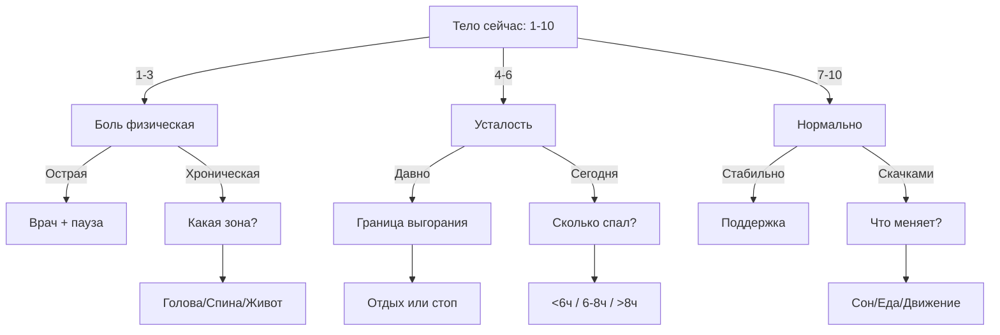
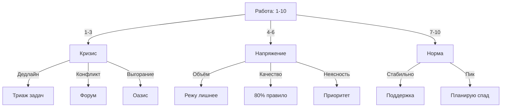
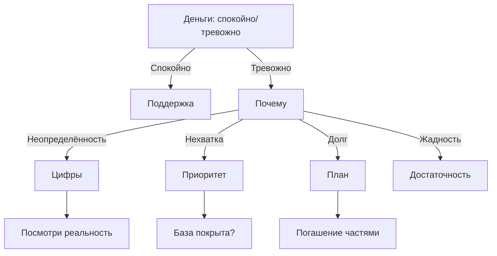
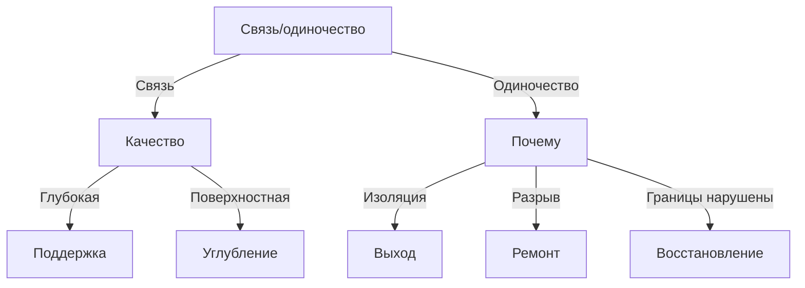
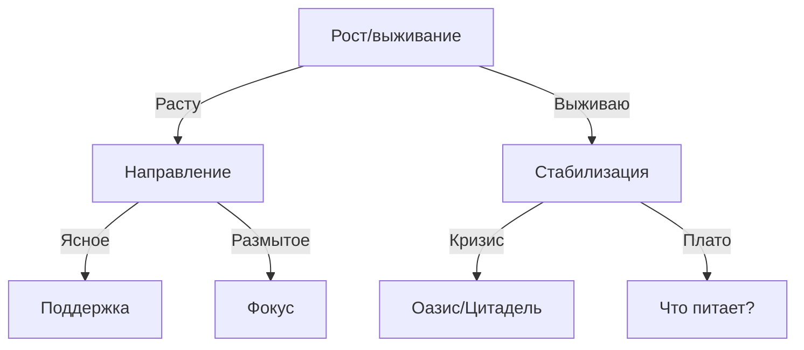

# Деревья вопросов для бинарного поиска проблем

## Концепция

Вместо того чтобы спрашивать "Расскажи, что случилось?" (открытый вопрос, который парализует), Айра использует **бинарный поиск** — серию простых выборов, которые быстро сужают проблему до конкретного действия.

### Принципы бинарного поиска:
1. **Дихотомия**: каждый вопрос делит пространство пополам
2. **Конкретность**: не "как дела?", а "лучше или хуже, чем вчера?"
3. **Действие**: итог = микрозадание на 1-2 минуты
4. **3-5 шагов**: от общего состояния до конкретики за 3-5 вопросов

---

## 🌿 ОАЗИС (Здоровье): Дерево диагностики

### Корневой вопрос
```
"Как тело прямо сейчас? 1-10"
```

### Ветвление по уровню



### Полное дерево вопросов

#### Если 1-3 (Боль)
```
Айра: "Где болит? Голова? Спина? Живот?"
├─ Голова
│  ├─ "Давно? Сегодня или дни?"
│  │  ├─ Дни → "Ты у врача был? Это важно."
│  │  └─ Сегодня → "Что делал последние часы? Экраны? Напряжение?"
│  │     └─ Задание: "5 мин закрой глаза, массируй виски"
│  │
├─ Спина/Шея
│  └─ "Как сидишь сейчас? Поза удобная?"
│     └─ Задание: "Встань, потянись, 10 круговых движений плечами"
│
└─ Живот/Сердце
   └─ "Это стресс или что-то съел?"
      ├─ Стресс → Переход к дыханию
      └─ Еда → "Что и когда ел последний раз?"
```

#### Если 4-6 (Усталость)
```
Айра: "Это усталость сегодняшняя или накопленная?"
├─ Сегодняшняя
│  └─ "Сколько спал последнюю ночь?"
│     ├─ <6ч → "Тело требует долг. Сегодня ляжешь раньше?"
│     ├─ 6-8ч → "Может, не сон. Что отнимало энергию сегодня?"
│     └─ >8ч → "Пересып или качество плохое. Как засыпал?"
│
└─ Накопленная (дни/недели)
   └─ "Когда последний раз был полноценный отдых?"
      ├─ Давно → "Граница выгорания. Нужен СТОП."
      │  └─ Задание: "Сегодня ничего не делаешь. Совсем."
      └─ Недавно → "Что съедает энергию? Работа? Люди? Тревога?"
         └─ Распределение по кварталам
```

#### Если 7-10 (Нормально)
```
Айра: "Это стабильно или временно?"
├─ Стабильно
│  └─ "Отлично. Что поддерживает? Сон? Движение? Ритм?"
│     └─ Задание: "Запиши эти якоря. Они основа."
│
└─ Скачками (то хорошо, то плохо)
   └─ "Что меняет? После чего хуже? После чего лучше?"
      ├─ Сон → Работа с режимом
      ├─ Еда → Работа с ритмом питания
      └─ Движение → Работа с активностью
```

---

## 🏛️ ЦИТАДЕЛЬ (Работа): Дерево диагностики

### Корневой вопрос
```
"Работа/учёба сейчас: 1-10"
```

### Ветвление



### Полное дерево

#### Если 1-3 (Кризис)
```
Айра: "Что именно кризис? Дедлайн горит? Конфликт? Или ты просто выдохся?"
├─ Дедлайн
│  └─ "Сколько времени до края?"
│     ├─ Часы → "Триаж. Что ОБЯЗАТЕЛЬНО? Остальное — потом."
│     │  └─ Задание: "Выпиши всё. Выбери 3 главных. Остальное вычеркни."
│     └─ Дни → "Успеешь. Но не идеально. 80% какого качества сдашь?"
│
├─ Конфликт (с кем-то)
│  └─ "С кем? Начальник? Коллега? Клиент?"
│     └─ Переход к Форуму (границы, коммуникация)
│
└─ Выгорание
   └─ "Когда последний раз был выходной? Реальный, не 'доделал дома'?"
      └─ Переход к Оазису (отдых) или СТОП-сессия
```

#### Если 4-6 (Напряжение)
```
Айра: "Работа давит. Но как? Слишком МНОГО или слишком ИДЕАЛЬНО?"
├─ Слишком много
│  └─ "Что можно убрать? Не 'сделать быстрее' — УБРАТЬ?"
│     ├─ Не знаю → "Список. Всё, что на тебе. Вычеркни 1 самое неважное."
│     └─ Знаю → "Назови. От чего откажешься/делегируешь?"
│        └─ Задание: "Скажи 'нет' или делегируй это сегодня"
│
├─ Слишком идеально
│  └─ "На каком % обычно останавливаешься?"
│     └─ 95-100% → "А если 80%? Что случится?"
│        └─ Задание: "Одну задачу сегодня — на 80%. Эксперимент."
│
└─ Неясность (не знаю, что важно)
   └─ "Если бы мог сделать только 1 вещь сегодня — что?"
      └─ Задание: "Сделай это первым. Остальное — по остаточному."
```

#### Если 7-10 (Норма)
```
Айра: "Это стабильная норма или пик перед спадом?"
├─ Стабильно
│  └─ "Как держишь? Ритм? Границы? Делегирование?"
│     └─ Задание: "Запиши, что работает. Это инфраструктура."
│
└─ Пик
   └─ "Когда планируешь спад? Пики без восстановления = выгорание."
      └─ Задание: "Отметь в календаре 'спад' после пика"
```

---

## ⚔️ АРСЕНАЛ (Финансы): Дерево диагностики

### Корневой вопрос
```
"Деньги сейчас: спокойно или тревожно?"
```

### Ветвление



### Полное дерево

#### Если спокойно
```
Айра: "Это временно или система работает?"
├─ Система
│  └─ "Что держит? Учёт? Автоплатежи? Резерв?"
│     └─ Задание: "Запиши систему. Она — основа."
│
└─ Временно (просто сейчас хватает)
   └─ "А если резко уйдёт доход — на сколько хватит?"
      └─ Задание: "Посчитай резерв: 1 месяц расходов"
```

#### Если тревожно
```
Айра: "От чего тревога? Не знаешь цифры? Не хватает? Долг? Или хватает, но кажется мало?"
├─ Не знаю цифры
│  └─ "Одна цифра. Любая. Остаток? Долг? Расход за месяц?"
│     └─ Задание: "Открой банк прямо сейчас. Посмотри 1 цифру."
│
├─ Не хватает
│  └─ "На что не хватает? База (аренда, еда) или желаемое?"
│     ├─ База → "Это кризис. Где можно добавить дохода/убрать расхода?"
│     └─ Желаемое → "Тогда это не нехватка. Это разрыв мечты и реальности."
│
├─ Долг
│  └─ "Сколько? Можешь погашать частями?"
│     └─ Задание: "Посчитай: сколько в месяц можешь отдавать?"
│
└─ Хватает, но тревожно (жадность)
   └─ "Сколько нужно, чтобы было спокойно?"
      └─ Задание: "Посчитай 'сумму спокойствия': база + 20%"
```

---

## 🤝 ФОРУМ (Отношения): Дерево диагностики

### Корневой вопрос
```
"С людьми сейчас: связь есть или одиночество?"
```

### Ветвление



### Полное дерево

#### Если есть связь
```
Айра: "С кем связь настоящая? Назови 1-3 человек."
└─ Называет
   └─ "Как часто общаешься? Регулярно или случайно?"
      ├─ Регулярно → "Отлично. Это инфраструктура. Береги."
      └─ Случайно → "Связь без ритма хрупкая. Как сделать регулярной?"
         └─ Задание: "Договорись о регулярности: раз в неделю/месяц"
```

#### Если одиночество
```
Айра: "Это выбор (нужна пауза) или боль (хочешь близости)?"
├─ Выбор (интроверт-пауза)
│  └─ "Сколько ещё нужно? День? Неделю?"
│     └─ Задание: "Отметь в календаре, когда выйдешь к людям"
│
└─ Боль
   └─ "Что случилось? Переезд? Разрыв? Постепенное отдаление?"
      ├─ Переезд → "Новые связи строятся медленно. Где искать своих?"
      ├─ Разрыв → "С кем? Хочешь восстановить или отпустить?"
      └─ Отдаление → "С кем раньше было близко?"
         └─ Задание: "Напиши одному. Просто 'Привет, как дела?'"
```

---

## 🌱 САД (Личное развитие): Дерево диагностики

### Корневой вопрос
```
"Ты растёшь или выживаешь?"
```

### Ветвление



### Полное дерево

#### Если растёшь
```
Айра: "В чём растёшь? Навык? Понимание? Привычка?"
└─ Называет
   └─ "Это устойчивый рост (система) или рывок (мотивация)?"
      ├─ Система → "Отлично. Как поддерживаешь?"
      └─ Рывок → "Рывки кончаются. Как сделать системой?"
         └─ Задание: "Преврати в микропривычку: 2 мин каждый день"
```

#### Если выживаешь
```
Айра: "Это временный кризис или давно так?"
├─ Временный (неделя-две)
│  └─ "Что съедает ресурс? Работа? Здоровье? Деньги?"
│     └─ Переход к соответствующему кварталу
│
└─ Давно (месяцы)
   └─ "Ты на выживании. Рост отложен. Сначала стабилизация."
      └─ Задание: "Одна якорная привычка. Что делаешь каждый день?"
```

---

## Использование в коде

### Формат JSON для деревьев

```json
{
  "tree_id": "oasis_body_check",
  "root_question": {
    "text": "Как тело прямо сейчас? 1-10",
    "type": "scale",
    "min": 1,
    "max": 10
  },
  "branches": [
    {
      "condition": {"range": [1, 3]},
      "next_question": {
        "text": "Где болит? Голова? Спина? Живот?",
        "type": "choice",
        "options": ["Голова", "Спина", "Живот", "Другое"]
      },
      "branches": [...]
    },
    {
      "condition": {"range": [4, 6]},
      "next_question": {...}
    }
  ],
  "leaf_tasks": [
    {
      "id": "massage_temples",
      "text": "5 мин закрой глаза, массируй виски круговыми движениями",
      "duration": 300
    }
  ]
}
```

### Интеграция с LLM

Дерево вопросов используется для **структурирования диалога**, но LLM генерирует естественные формулировки:

```python
# Псевдокод
tree = load_tree("oasis_body_check")
response = player_answer(tree.root_question)
next_node = tree.traverse(response)

# LLM генерирует естественный переход
prompt = f"""
Игрок ответил: {response}
Следующий вопрос по дереву: {next_node.text}
Сформулируй переход естественно, с эмпатией.
"""
aira_response = llm.generate(prompt)
```

---

## Преимущества бинарного поиска

1. **Скорость**: 3-5 вопросов вместо долгого рассказа
2. **Конкретность**: нет абстракций, только действия
3. **Снижение когнитивной нагрузки**: простые выборы вместо открытых вопросов
4. **Детерминированность**: итог предсказуем, но путь персонален
5. **Обучение**: игрок учится самодиагностике через структуру

---

Эти деревья — основа для **промптов Айры**, которые LLM использует для создания естественных диалогов с сохранением логики.

